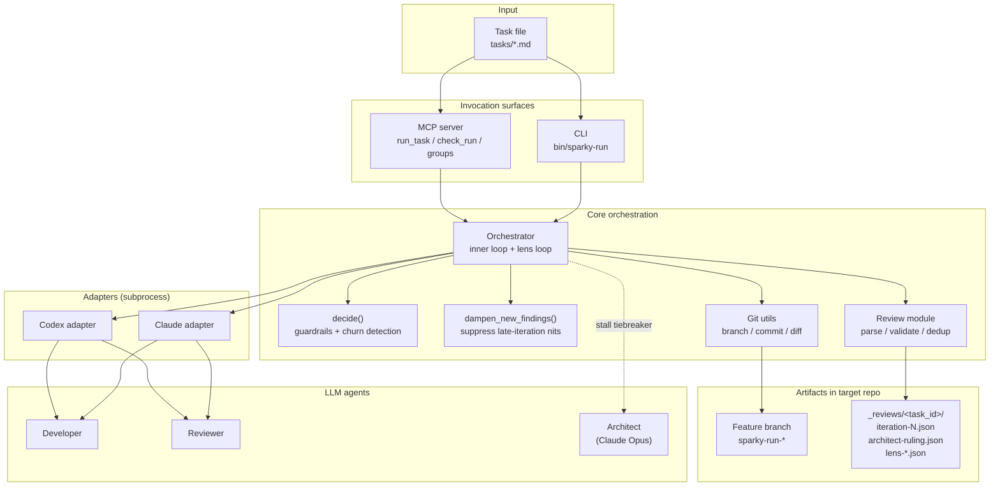

# Sparky: Dual-LLM Development Orchestrator

Sparky is an autonomous code development system that pairs two LLM agents — a **Developer** and a **Reviewer** — in an iterative loop that converges on working, reviewed code. The Developer writes code (following TDD practices), the Reviewer evaluates it against acceptance criteria defined in a task file, and the loop continues until the Reviewer passes the work or the system detects it has stalled. The default pairing is Claude as Developer and Codex as Reviewer, deliberately choosing different model families for cognitive diversity: the Developer builds, the Reviewer catches what the Developer missed from a different analytical perspective, and the Developer fixes what the Reviewer found. When the two agents cannot converge, a third agent — an **Opus Architect** — is invoked as a binding tiebreaker.

## System Overview

At the outermost layer Sparky is a task runner. A task file (self-contained markdown with context, requirements, acceptance criteria, and verification commands) is fed to an invocation surface — either the `sparky-run` CLI or the MCP server — which hands it to the Orchestrator. The Orchestrator then drives the two LLM agents through their adapters, commits their work to a dedicated feature branch in the target repository, and writes structured review artifacts to `_reviews/<task_id>/` for later inspection.



The Orchestrator is the only component that knows about iterations, convergence, or mediation. Adapters are dumb shells: they format a prompt, shell out to the appropriate CLI (`claude` or `codex`), capture stdout, and return it. The Review module parses the Reviewer's JSON against a schema, deduplicates findings across lenses, and renders findings as markdown for the next Developer prompt. Everything downstream of the Orchestrator — git operations, review files, branch cleanup — is performed on behalf of the agents, not by them.

## The Developer / Reviewer Loop with Architect Mediation

The heart of Sparky is the **inner loop**, where the Developer and Reviewer alternate until convergence. On each iteration the Developer receives either the initial task (iteration 1) or the Reviewer's prior findings (iterations 2+), writes or edits code, and the Orchestrator commits the diff. The Reviewer then inspects the committed diff against the acceptance criteria and emits a structured JSON verdict: `pass`, `iterate`, or `fail`, with findings categorized by severity (`must-fix`, `should-fix`, `nit`). The Orchestrator's `decide()` function maps the verdict plus context to the next action using three guardrails — a `pass` verdict with any `must-fix` finding is coerced to `iterate`, an `iterate` verdict with zero findings is coerced to success, and an absolute iteration cap prevents runaway cycles. A separate **churn detector** tracks finding counts across iterations; two consecutive non-decreasing counts mean the loop is no longer making progress and is declared stalled.

Churn is the failure mode the Architect exists to solve. When the Developer and Reviewer disagree on what matters — the Reviewer keeps raising the same concern in different words, the Developer keeps pushing back or fixing something slightly adjacent — finding counts plateau and the loop burns iterations without converging. At the **third inner-loop iteration**, if the loop is still in `iterate` or `stalled` state, the Orchestrator escalates to the Architect (Claude Opus 4.6). The Architect is given the full context the two agents saw — task description, acceptance criteria, current diff, developer notes, every outstanding finding, and the iteration-by-iteration finding-count history — and is asked to arbitrate. For each finding, the Architect either **KEEPs** it (valid, must be addressed) or **DISMISSes** it (overreach, not worth the iteration cost, or already adequately handled). The Architect's output is a `ReviewResult` containing only the kept findings plus `meta.dismissed_finding_ids` and a `meta.approach` paragraph recommending how to proceed.

That ruling is **binding**. The Orchestrator injects the ruling as an "Architect Ruling (Binding)" section into subsequent Developer and Reviewer prompts — the Developer is told to address only the kept findings and never re-raise the dismissed ones, and the Reviewer is told to stop asking about them. Finally, the finding-count history is cleared so that churn detection restarts fresh from the post-mediation state. The architect is only invoked if `max_iterations > 3`, so there is always headroom for the loop to actually apply the ruling before hitting the cap.

```mermaid
flowchart TD
    START(["Iteration starts<br/>(task or prior findings)"]) --> DEV["Developer agent<br/>writes/edits code"]
    DEV --> DIFF{"git diff<br/>non-empty?"}
    DIFF -- no --> STALL1(["STALLED<br/>no changes detected"])
    DIFF -- yes --> COMMIT["Commit to<br/>feature branch"]
    COMMIT --> REVR["Reviewer agent<br/>evaluates diff vs criteria"]
    REVR --> DAMP["dampen_new_findings()<br/>drops new nits once<br/>iteration &gt; nit_threshold"]
    DAMP --> PERSIST["Persist review to<br/>_reviews/&lt;task&gt;/iteration-N.json"]
    PERSIST --> DEC{"decide()"}

    DEC -- "verdict=pass<br/>no must-fix" --> PASS(["EXIT_SUCCESS"])
    DEC -- "verdict=fail" --> FAIL(["EXIT_FAIL"])
    DEC -- "iteration &ge; cap" --> STALL2(["STALLED<br/>iteration cap"])
    DEC -- "2 non-decreasing<br/>finding counts" --> STALL3(["STALLED<br/>churn detected"])
    DEC -- "verdict=iterate" --> TRIG{"Architect trigger?<br/>inner iter == 3<br/>and action in<br/>iterate / stalled"}

    TRIG -- no --> DEV
    TRIG -- yes --> ARCH["Architect (Opus)<br/>sees task, criteria, diff,<br/>findings, dev notes,<br/>iteration history"]
    ARCH --> RULE["For each finding:<br/>KEEP or DISMISS<br/>+ approach paragraph"]
    RULE --> BIND["Inject binding ruling<br/>into Developer and<br/>Reviewer prompts"]
    BIND --> RESET["Clear finding_counts<br/>(reset churn detector)"]
    RESET --> DEV

    style ARCH fill:#333333,stroke:#b8860b,stroke-width:2px
    style RULE fill:#333333,stroke:#b8860b,stroke-width:2px
    style BIND fill:#333333,stroke:#b8860b,stroke-width:2px
    style RESET fill:#333333,stroke:#b8860b,stroke-width:2px
```



Two further details round out the loop behavior the diagram sketches. **Nit dampening** — driven by `dampen_new_findings()` — drops any *newly raised* nit-severity finding once the iteration count exceeds `nit_threshold` (default 2), on the principle that late-iteration cosmetic feedback is a near-universal source of churn that rarely reflects real risk. **Developer notes** (`_developer_notes.md`, written by the Developer on iteration 2+) give the Developer a channel to justify pushback to the Reviewer and, later, to the Architect — so the Architect is judging the disagreement from both sides, not just from the Reviewer's paper trail.

## Modes, Lenses, and Task Groups

The inner loop has two entry points. In **build mode** the Developer goes first (no prior findings), drafts the code, and the Reviewer performs the first review. In **audit mode** (`--reviewer-first`) the Reviewer audits existing code against the task's criteria before the Developer ever runs, and the Developer's job is purely to fix what was found. In both modes the remainder of the loop — commit, review, decide, mediate — is identical.

Once the inner loop passes, an optional **lens loop** runs specialized read-only reviews (`conformance`, `resilience`, `maintainability`). Each lens evaluates the final code with a domain-specific lens prompt; findings are deduplicated across lenses (same file:line from multiple lenses collapses into one, highest severity wins); if any `must-fix` remains, the Orchestrator reuses the inner loop to fix them. The lens loop has its own Architect tiebreaker (`LENS_ARCHITECT_TRIGGER = 2`) that behaves identically to the inner-loop one, and the lens loop itself is capped at three rounds.

On top of single-task runs, **task groups** sequence multiple tasks onto a single evolving branch so later tasks build on earlier committed changes. Groups with worktree isolation can run in parallel against different areas of the codebase, and the group lifecycle is gated: a completed group produces a branch ready for human review, with an explicit confirmation step before merging to main. This is how Sparky scales from a single task to a coordinated multi-step campaign — audit a codebase, generate findings, fan them out as a prioritized group, and converge the whole batch into one reviewable branch.

## Results

Operational results have validated the approach. In the Open Brain dashboard project, 12 of 12 focused tasks passed with an average of 1.6 iterations per task. A subsequent audit-driven campaign took the codebase from initial scaffold to fully audit-clean in three rounds: Round 1 found 13 findings and generated 14 Sparky tasks (all passed), Round 2 found 3 remaining findings and generated 2 tasks (all passed), and the final audit returned zero critical or major findings — 16/16 total success rate. The consistent lesson is task scoping: small, focused tasks targeting 1–4 related files converge in 1–2 iterations, while larger tasks tend to stall because the Reviewer can't verify everything or the prompt exceeds context limits. The best pattern is to use an audit to identify specific findings, then assign each finding as a separate Sparky task.

## Running Sparky

```bash
# Build mode (developer goes first)
bin/sparky-run --task tasks/<slug>.md --repo <target-repo> \
  --developer claude --reviewer codex --log /tmp/sparky-<slug>.log

# Audit mode (reviewer goes first)
bin/sparky-run --task tasks/<slug>.md --repo <target-repo> \
  --developer claude --reviewer codex --reviewer-first \
  --log /tmp/sparky-<slug>.log
```

Key flags: `--repo` (target repository), `--self-dev` (worktree isolation for developing Sparky itself), `--plan` (planning phase before the dev loop), `--max-iterations N` (cap iterations, default 5), `--lenses conformance,resilience,maintainability` (enable the lens loop), `--reviewer-exec` (let a Claude reviewer execute verification commands; Codex already has exec by default).

## Operational Constraints

Known operational constraints inform how Sparky fits into a larger orchestration. All source code must be committed to the base branch before launching a run — Sparky branches from HEAD, and uncommitted files are invisible to the agents. Build artifacts and generated files must be gitignored to prevent reviewer context overflow. Runs typically take 10–20 minutes for multi-iteration tasks, which has caused timeout issues when Sparky is dispatched by other orchestrators with shorter caps — any outer system needs to allow at least 20 minutes per task. Exit code 3 (unhandled exception) can masquerade as a clean pass if not checked carefully, so pipeline integrations should always verify exit codes and commit counts rather than assuming silence means success.
